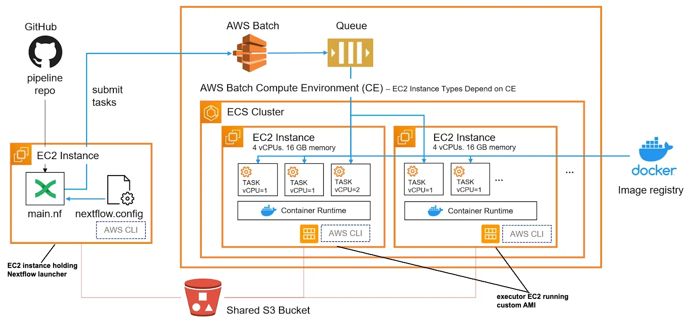

# Set up of AWS Batch to be used with Nextflow via AWS CLI

There are multiple tutorial describing the process of setting up AWS Batch to
be used with [Nextflow](https://www.nextflow.io/). For example, 
[one by Kelsey Florek](https://staphb.org/resources/2020-04-29-nextflow_batch.html#step-1-setting-up-a-nextflow-user-with-iam)
or [one by Tobias Neumann](https://t-neumann.github.io/pipelines/AWS-pipeline/).
While they do go rather thoroughly though the process, they only demonstrate 
the set up based on AWS console (i.e. button clicking) which is not scalable 
shall you wish to deploy multiple pipeline or the same pipeline with multiple
configuration. To be able to scale pipeline execution it is reasonable to use
AWS command line interface (CLI) and corresponding command line commands 
instead of the console. It also makes the set up more reproducible and 
traceable. Ideally, such set up should be done via Terraform, but one has to
start somewhere.

This README is **not** a comprehensive tutorial for the set up and does not 
provide a detailed description and reasoning behind all the commands in the 
scripts. This is why it is rather beneficial to first read though the tutorials
mentioned above. Also, the scripts do not replicate tutorials one to one as 
some of the parameters were initialized very far from their use place therefore
introducing confusion. 

The scripts operate under assumption that you already have VPC, subnetworks and 
users/profiles with privileges to create users, user groups, security groups,
ec2 instances, computing environments and job queues.

# Step 1: create the custom AMI
 The image
is taken from [here](https://seqera.io/blog/nextflow-and-aws-batch-inside-the-integration-part-1-of-3/).

The schema shows a birds eye view on Nextflow integration with AWS Batch. If 
simplified to the extreme, we first need to configure the "executer" EC2 
instances by installation of all the software needed during Nextflow's 
execution of tasks on that instance. Usually if the pipeline is properly 
containerized one would only need Docker, AWS CLI and esc (Amazon Elastic 
Container Service). AWS CLI is needed for communication between AWS Batch and
EC2 instance which runs the task and EC2 instance which launches the Nextflow
pipeline. Similarly, esc is needed for communication with container services.
In order to permit AWS to create as many executor EC2 instances as required 
with all the needed software installed, we have to save our "preset" as AMI 
(Amazon Machine Instance). Once AMI is created, it can be reused in all 
Nextflow pipelines.

Script `create_custom_ami.sh` does exactly that:
```
# make script executable
chmod +x create_custom_ami.sh
./create_custom_ami.sh -p admin_user_profile \
                       -r "eu-west-2" \
                       -i "t3.2xlarge" \
                       -u "your_user_name"
```
Please see below the full list of input arguments:

- `-p` [REQUIRED] AWS profile name. That profile should have permissions to 
create users, user groups, security groups and ec2 instances.
- `-r` [REQUIRED] AWS region, i.e. `eu-west-2`. Put it in double quotes.
- `-i` [REQUIRED] AWS instance type, i.e. `t3.2xlarge`
- `-u` [REQUIRED] User name of the person executing this script.
- `-e` [optional] Name of an EC2 instance. Default: `nf-EC2-` plus value of 
`-u` argument
- `-a` [optional] Name under which custom AMI will be saved. Default: 
`ami-nf-aws-batch-` plus value of `-u` argument
- `-b` [optional] Name of the base AMI. Default: 
`/aws/service/ecs/optimized-ami/amazon-linux-2023/recommended`
- `-h` [optional] print help message.

During script execution you may be asked for the password and code from your 
MFA device as well as if you agree to add EC2 in the list of your known hosts.
Type `yes` in the latter case. 

Do not forget to replace `admin_user_profile`, `eu-west-2`, `t3.2xlarge` and
`your_user_name` with the actual parameters.

If script's execution is successful, an AMI named 
`ami-nf-aws-batch-your_user_name` will be created (if you used default `-a` 
argument). This AMI will have Docker, AWS CLI, esc, git, Java and Nextflow 
installed. You will be able to see it in your AWS console (Services > EC2 > 
AMIs or just type "AMI" in the search bar).

# Step 2: configure AWS Batch
Now, using the custom AMI created on the previous step we can created AWS
batch compute environment and queue. The environment and queue are essentially
emulators of high performance computer cluster, i.e. lots of computers with 
exactly the same set up (it is coming from AMI), work of which is managed by 
queue. Script `configure_aws_batch.sh` will create AWS batch set up for you. It
will also create a user and user group for you which Nextflow will use to 
assess AWS batch. Finally, it will create an S3 bucket where the results of 
pipeline execution will be stored.

```
# make script executable
chmod +x configure_aws_batch.sh
./configure_aws_batch.sh -p admin_user_profile \
                         -r "eu-west-2" \
                         -u "your_user_name" \
                         -b "s3-nf-bucket"
```
Please see below the full list of input arguments:

- `-p` [REQUIRED] AWS profile name. That profile should have permissions to 
create users, user groups, security groups and ec2 instances.
- `-r` [REQUIRED] AWS region, i.e. eu-west-2. Put it in double quotes.
- `-u` [REQUIRED] User name of the person executing this script.
- `-b` [REQUIRED] A name for S3 bucket to store files in. S3 bucket names can 
consist only of lowercase letters, numbers, dots (.), and hyphens (-).
- `-a` [optional] Name of custom AMI with installed at least Docker, ecs and 
AWS CLI. Default: `ami-nf-aws-batch-` plus value of `-u` argument. If you set
up a custom AMI name in the `create_custom_ami.sh`, use it here too.
- `-i` [optional] User name to be given to the new user under which Nextflow
will assess AWS batch. Default: `nf-program-access-` plus value of `-u` 
argument.
- `-g` [optional] User group name to be given to the new user group under 
which Nextflow will assess AWS batch. Default: `nf-group-` plus value of `-u`
argument.
- `-e` [optional] Name of an EC2 instance. Default: `nf-EC2-` plus value of 
`-u` argument.
- `-c` [optional] Name of the new AWS Batch compute environment under which 
Nextflow will run jobs. Default: `nf-aws-batch-` plus value of `-u` argument.
- `-j` [optional] Name of the new AWS Batch job queue under which Nextflow 
will run jobs. Default: `nf-queue-` plus value of `-u` argument.
- `-h` print help message,

Do not forget to replace `admin_user_profile`, `eu-west-2`, `s3-nf-bucket` and
`your_user_name` with the actual parameters.

Upon script's successful execution a user named `nf-program-access-` plus 
value of `-u` argument, a user group named `nf-group-` plus value of `-u`
argument, a compute environment named `nf-aws-batch-` plus value of `-u` 
argument and an AWS Batch job queue named  `nf-queue-` plus value of `-u` 
argument will be create in case of default arguments given to the script. In
addition, a S3 bucket will be created.

# Step 3: create EC2 instance - Nextflow launcher
At the final step of the set up, an EC2 instance which will be used for
launching a Nextflow pipeline will be created. While a custom AMI created on
the first step will be used for that too, it is not strictly nessecacy.
Ultimately, one would only need Nextflow, AWS CLI and esc installed on that 
instance. 

The script `create_nextflow_launcher_ec2.sh` created the Nextlow launcher EC2
instance:
```
# make script executable
chmod +x create_nextflow_launcher_ec2.sh
./create_nextflow_launcher_ec2.sh -p admin_user_profile \
                                  -r "eu-west-2" \
                                  -u "your_user_name" \
                                  -t "t3.2xlarge"
```
Please see below the full list of input arguments:
- `p` [REQUIRED] AWS profile name. That profile should have permissions to 
create users, user groups, security groups and ec2 instances.
- `r` [REQUIRED] AWS region, i.e. `eu-west-2`. Put it in double quotes.
- `t` [REQUIRED] AWS instance type, i.e. `t3.2xlarge`
- `u` [REQUIRED] User name of the person executing this script.
- `i` [optional] User name to be given to a user under which Nextflow will
assess AWS batch. Default: Default: `nf-program-access-` plus value of `-u`
argument.
- `e` [optional] Name of an EC2 instance to be created. Default: `nf-EC2-` plus
value of `-u` argument.
- `a` [optional] Name of the custom AMI to be used. Default: 
`ami-nf-aws-batch-` plus value of `-u` argument
- `h` print the help message

Do not forget to replace `admin_user_profile`, `eu-west-2`, `t3.2xlarge` and
`your_user_name` with the actual parameters.

Upon script's successful execution, you will see a message with the `ssh` 
command you'll need to execute to log in to the newly created EC2 instance
which holds Nextflow launcher:

```
ssh -i key_pair.pem ec2-user@ec2-XX-XXX-XXX-XX.eu-west-2.compute.amazonaws.com
```
where `key_pair.pem` stands for the key pair file created by the script. If the
default settings were used, it will be `nf-EC2-your_user_name-keypair.pem`. 
You'll also see numbers instead of XX. `eu-west-2` should be replaced by the 
corresponding region which you set up during script's execution. 

Record this command as it will be used on the next step.

# Step 4: configure Nextflow & execute the pipeline
Nextflow pipeline execution on AWS will be demonstrated on the small RNA-seq 
pipeline called [`rnaseq-nf`](https://github.com/nextflow-io/rnaseq-nf/). To 
execute this pipeline, 3 files will be needed: `ggal_lung_R1.fq`, 
`ggal_lung_R2.fq` and `ggal_1_48850000_49020000.Ggal71.500bpflank.fa`. All 
these files can be downloaded from the 
(github repo of the pipeline)[https://github.com/nextflow-io/rnaseq-nf/tree/master/data/ggal]. 
Then, upload these files to the S3 bucket created on the step 2 via console. 
You're now ready to execute Nextflow pipeline.

Login to the EC2 instance holding Nextflow launcher (copy the command displayed
at the end of the execution of the previous step):
```
ssh -i key_pair.pem ec2-user@ec2-XX-XXX-XXX-XX.eu-west-2.compute.amazonaws.com
```
Next, pull the pipeline:
```
nextflow pull rnaseq-nf
```
By default, pipeline code will be stored in `~/.nextflow/assets/nextflow-io/`
folder. Modify `~/.nextflow/assets/nextflow-io/rnaseq-nf/nextflow.config` via
`vi` editor:

```
vi ~/.nextflow/assets/nextflow-io/rnaseq-nf/nextflow.config
```
Replace `batch` section of the file (lines 74 - 83) with the following:
```
  batch {
    params.reads = 's3://s3-nf-bucket/ggal_lung_{1,2}.fq'
    params.transcriptome = 's3://s3-nf-bucket/ggal_1_48850000_49020000.Ggal71.500bpflank.fa'
    process.container = 'quay.io/nextflow/rnaseq-nf:v1.2.1'
    process.executor = 'awsbatch'
    process.queue = 'nf-queue-your_user_name'
    workDir = 's3://s3-nf-bucket/work'
    aws.region = 'eu-west-2'
    aws.batch.cliPath = '/home/ec2-user/miniconda/bin/aws'
  }
```
Do not forget to replace `s3-nf-bucket`, `eu-west-2` and 
`nf-queue-your_user_name` with the corresponding values which you set up during
the script's execution. 

Save and exit the script by pressing `esc` button, and then pressing 
combination of `:`, `w` and `q`.

Finally, run the pipeline:

```
nextflow run rnaseq-nf -profile batch --output s3://s3-nf-bucket/results/
```
You should see the following messages appear:

```
 N E X T F L O W   ~  version 24.04.2

Launching `https://github.com/nextflow-io/rnaseq-nf` [awesome_elion] DSL2 - revision: 55133f624d [master]

 R N A S E Q - N F   P I P E L I N E
 ===================================
 transcriptome: s3://s3-nf-bucket/data/ggal/ggal_1_48850000_49020000.Ggal71.500bpflank.fa
 reads        : s3://s3-nf-bucket/data/ggal/ggal_lung_{1,2}.fq
 outdir       : results
 
Uploading local `bin` scripts folder to s3://s3-nf-bucket/work/tmp/4b/03994f65eb8ca2085bc9bb8c64e800/bin
executor >  awsbatch (4)
[2e/dd7495] RNASEQ:INDEX (ggal_1_48850000_49020000) [100%] 1 of 1 ✔
[3d/a0aa23] RNASEQ:FASTQC (FASTQC on ggal_lung)     [100%] 1 of 1 ✔
[b7/ec11b6] RNASEQ:QUANT (ggal_lung)                [100%] 1 of 1 ✔
[3f/6185ea] MULTIQC                                 [100%] 1 of 1 ✔
Completed at: 17-Jun-2024 08:50:06
Duration    : 6m 51s
CPU hours   : (a few seconds)
Succeeded   : 4
```

In case the pipeline run can take a very long time to complete, consider using
`-bg` option.

# Step 5: clean up after Nextflow pipeline completion
Run script `clean_up_aws_batch.sh` to delete user, user group, role, security
group, AWS batch queue and compute environment and EC2 instance holding the 
Nextflow launcher created for the pipeline's execution:

```
chmod +x clean_up_aws_batch.sh
./cleanup.sh -p admin_user_profile -r "eu-west-2" -u "your_user_name" 
```

Please see below the full list of input arguments:

- `p` [REQUIRED] AWS profile name. That profile should have permissions to 
delete users, user groups, security groups and ec2 instances.
- `r` [REQUIRED] AWS region, i.e. `eu-west-2`. Put it in double quotes.
- `u` [REQUIRED] User name of the person executing this script.
- `i` [optional] User name of a user under which Nextflow assessed AWS batch. 
Default: `nf-program-access-` plus value of `-u` argument.
- `g` [optional] User group name to which user under which Nextflow assessed AWS
batch was assigned to. Default: `nf-group-` plus value of `-u` argument.
- `e` [optional] Name of an EC2 instance on which Nextflow launcher was set. 
Default: `nf-EC2-` plus value of `-u` argument.
- `c` [optional] Name of the AWS Batch compute environment under which Nextflow
had run jobs. Default: `nf-aws-batch-` plus value of `-u` argument.
- `j` [optional] Name of the AWS Batch job queue under which Nextflow had run
jobs. Default: `nf-queue-` plus value of `-u` argument.
- `h` print this help

> Attention! `clean_up_aws_batch.sh` will not delete custom AMI created at step
1 or S3 bucket created at step 2 as they can be reused (AMI) or contain results
of pipeline execution.